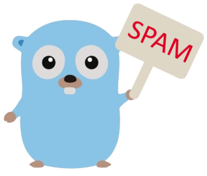

# spamchk 🔎🧾
> A tiny Go library which checks text for spam 

 <br>
The lib is a client for <a href="https://plino.herokuapp.com/">Plino</a> - spam filtering system <br>
It is suitable for e-mail or SMS verification but feel free to try and find out what it works good with!

# Usage 🖥
### verify string
```go
package main

import (
    "fmt"

    spam "github.com/irevenko/spamchk"
)

func main() {
    checkString := spam.IsStringSpam("Congrats you've won the Tesla car!")
    fmt.Println(checkString)
}
```
### verify text file
```go
package main

import (
    "fmt"

    spam "github.com/irevenko/spamchk"
)

func main() {
    checkFile := spam.IsTextFileSpam("test.txt")
    fmt.Println(checkFile)
}
```

# Contributing 🤝
Contributions, issues and feature requests are welcome! 👍 <br>
Feel free to check [open issues](https://github.com/irevenko/what-anime-cli/issues).

# What I Learned 🧠
- Text Processing
- How to create libraries in GoLang

# License 📑 
(c) 2021 Ilya Revenko. [MIT License](https://tldrlegal.com/license/mit-license)
